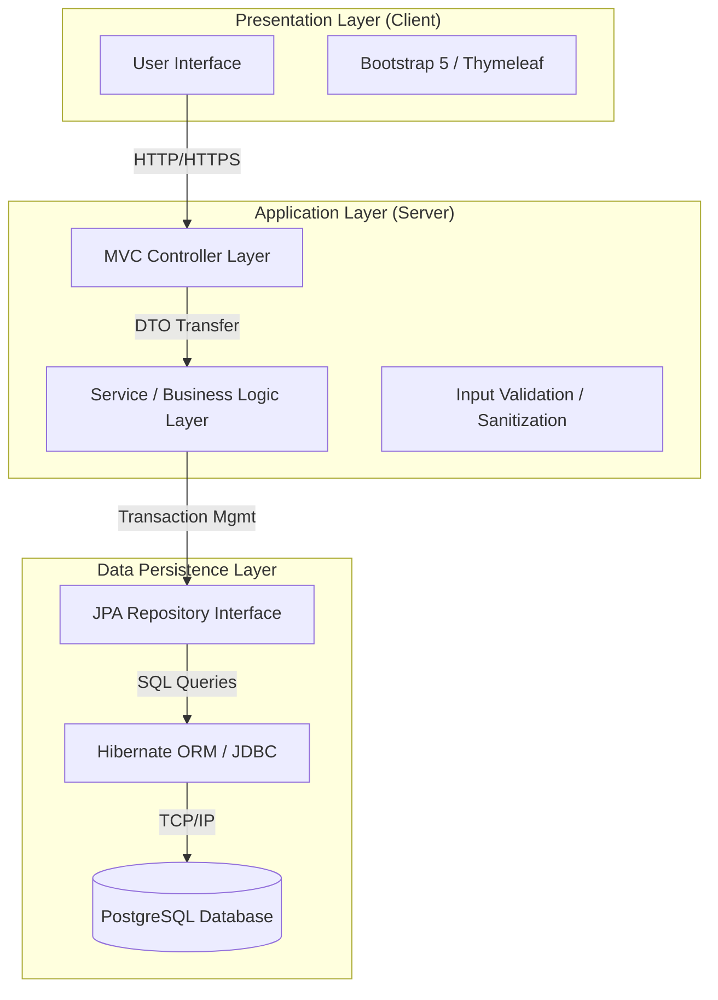

# 🛡️ EquipTrack: Enterprise Engineering Asset Management System


> **"Optimizing engineering efficiency through rigorous asset lifecycle tracking and inventory accountability."**

---

## 📖 Executive Summary

**EquipTrack** is a robust, internal corporate utility designed to modernize the management of critical engineering resources—ranging from calibrated sensors and lab instrumentation to field deployment tools. 

Built to align with rigorous industry standards for data integrity and traceability, EquipTrack replaces decentralized spreadsheet tracking with a centralized, **ACID-compliant relational database system**. The application leverages a traditional **Model-View-Controller (MVC)** architecture to ensure high performance, type safety, and seamless integration with existing enterprise Java environments.

---

## 🏗️ System Architecture & Design

The system implements a strict **N-Tier Layered Architecture**, decoupling presentation logic from business rules and data persistence. This design choice ensures modularity, testability, and adherence to the **Single Responsibility Principle (SRP)**.


## Architectural Decisions

### Server-Side MVC (Model-View-Controller):
* Utilization of Spring MVC to handle HTTP requests and route data to Thymeleaf templates.
* This approach minimizes client-side complexity and ensures compatibility with standard corporate IT security policies regarding JavaScript execution.

### Object-Oriented Domain Model:
* Core business entities (Asset, Employee, MaintenanceLog) are modeled as POJOs (Plain Old Java Objects) with strict encapsulation.
* Polymorphism allows for flexible categorization of assets (e.g., ElectronicComponent vs. MechanicalTool).

### Relational Database Design (SQL):
* Normalized schema (3NF) to prevent data redundancy.
* Foreign Key constraints enforce referential integrity between Assets and Custodians.

## 🛠️ Technology Stack

| Component | Technology Specification | Justification for Enterprise Use |
| :--- | :--- | :--- |
| **Language** | **Java 17 (LTS)** | Industry standard for stability, security, and long-term support. |
| **Framework** | **Spring Boot 3.x** | Rapid application development with embedded Tomcat server deployment. |
| **Architecture** | **MVC (Model-View-Controller)** | Separation of concerns; mandated by internal framework requirements. |
| **Frontend** | **Thymeleaf + Bootstrap 5** | Responsive, mobile-ready UI without the overhead of a heavy client-side SPA. |
| **Database** | **PostgreSQL 15** | ACID-compliant transactional storage for critical inventory data. |
| **ORM** | **Hibernate / Spring Data JPA** | Abstraction of complex SQL queries; prevention of SQL Injection attacks. |
| **DevOps** | **Docker & Docker Compose** | Containerization for consistent deployment across Dev, Stage, and Prod environments. |

## 🚀 Key Functional Modules
### 1. Asset Lifecycle Management
* **Ingestion**: Standardized entry forms for new equipment with mandatory serialization and categorization.
* **Retirement**: Protocols for decommissioning assets (setting status to RETIRED or SCRAPPED) while maintaining historical data for audit trails.

### 2. Operational Visibility
* **Real-Time Status Dashboard**: Color-coded indicators (AVAILABLE, ASSIGNED, MAINTENANCE) allow engineering leads to assess resource availability instantly.
* **Search & Retrieval:** Optimized SQL queries (findBySerialNumberContaining) allow for O(1) lookup speeds for specific tools.

### 3. Data Integrity & Validation
* **Backend Validation**: Java Bean Validation (@NotNull, @Size, @Pattern) prevents corrupt data from entering the system.
* **Concurrency Control**: Transactional boundaries ensure that two engineers cannot check out the same item simultaneously.

## 💾 Database Schema Design
The data model is designed to support high-volume transactions and complex reporting.

* *assets Table*: Stores immutable details (Serial No, Purchase Date) and mutable state (Status, Current Location).
* *users Table*: Role-based access control (Admin vs. Standard Engineer).
* *audit_logs Table*: An event-driven log capturing every status change for accountability.

## ⚙️ Deployment & Installation
The application is containerized to ensure "write once, run anywhere" reliability, essential for hybrid on-premise/cloud environments.

### Prerequisites
* Docker Desktop & Docker Compose
* Java JDK 17+

### Execution Protocol
1. Clone the Repository
```bash
git clone https://github.com/Shorya-agarwal/EquipTrack.git
cd EquipTrack
```
2. Ignite the Infrastructure (Database)
```bash

docker-compose up -d
# Initializes PostgreSQL container on Port 5432
```
3. Launch the Application
```Bash

./mvnw spring-boot:run
```
The system performs a health check and binds to http://localhost:8080.

## 🔮 Future Engineering Roadmap
* REST API Layer: Exposing endpoints to allow integration with mobile scanners (QR Code/Barcode asset tracking).

* Predictive Maintenance: Leveraging usage logs to flag equipment for calibration before failure occurs.

* LDAP Integration: Connecting to Active Directory for Single Sign-On (SSO) within the corporate network.

## 📜 License & Compliance
Developed for internal demonstration of proficiency in Enterprise Java Development. Adheres to standard open-source licensing (MIT).

>Shorya Agarwal | Systems Engineer & C++ Developer | MS CE @TAMU  | [](https://www.linkedin.com/in/shoryaag/) 